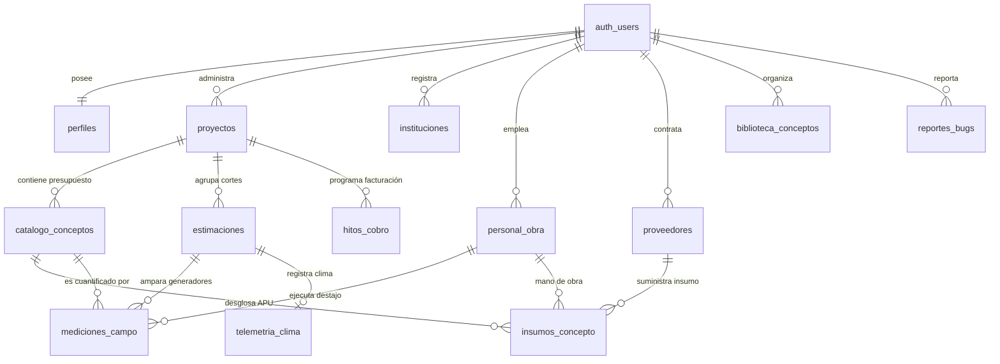

# ESTIMAPP 🏗️
### Plataforma Integral de Control Físico y Financiero de Obras Públicas y Privadas

> **AVISO PARA AGENTES DE INTELIGENCIA ARTIFICIAL (Antigravity / Pair Programming):**  
> La lectura de este documento, junto con [AGENTS.md](file:///c:/Users/disco/OneDrive/Escritorio/estimapp/AGENTS.md), [especificaciones.md](file:///c:/Users/disco/OneDrive/Escritorio/estimapp/especificaciones.md), [data_model_v2.0.md](file:///c:/Users/disco/OneDrive/Escritorio/estimapp/data_model_v2.0.md) y la carpeta de reportes históricos [development_status_reports/](file:///c:/Users/disco/OneDrive/Escritorio/estimapp/development_status_reports/) es **OBLIGATORIA** antes de proponer o aplicar cualquier cambio en este repositorio.

---

## 1. ¿Qué es Estimapp y Para qué Sirve?

**Estimapp** es una plataforma tecnológica *cloud-native* diseñada para digitalizar, estructurar y sincronizar el ciclo de vida técnico y financiero de la construcción en México y Latinoamérica. 

En la industria de la construcción existe una desconexión crítica entre tres mundos:
1. **El Presupuesto y Contrato Oficial**: Catálogos de conceptos contratados bajo licitación o cotización cliente.
2. **La Ejecución Física en Campo**: Mediciones volumétricas diarias, generadores con fórmulas geométricas y evidencias fotográficas dispersas.
3. **La Realidad Financiera Operativa**: El costo real de los materiales en plaza, el pago semanal de raya a destajistas y cuadrillas, el impacto del clima y el margen de utilidad genuino del despacho.

Estimapp resuelve esta fragmentación actuando como un **sistema operativo unificado** que vincula cada centímetro medido en campo directamente con el contrato oficial, la liquidación de raya y el balance financiero de rentabilidad en tiempo real.

---

## 2. Alcances del Sistema

- **Enfoque Tri-Modal Adaptativo**:
  - **Obra Pública**: Auditoría contractual clásica (Monto Contratado, Estimado Acumulado, Saldo por Ejercer, % de Avance y amortización de anticipos).
  - **Obra Privada**: Auditoría operativa y de negocio (Gastos Erogados Reales, Utilidad Bruta, Margen Real del Despacho y Semáforos de Desviación de Nómina).
  - **Mixta / Integral**: Despliegue en columnas paralelas con nivelación visual milimétrica para proyectos que requieren reportar a un cliente institucional mientras auditan su propia rentabilidad interna.
- **Generadores Volumétricos con Multi-Evidencia**:
  - Calculadoras geométricas reactivas en campo (`m²` rectangulares, triangulares y trapeciales, `m³`, `kg`, `litros`, `lote`, etc.).
  - Registro de múltiples fotografías y croquis técnicos por generador, optimizados y resguardados en Supabase Storage.
- **Liquidación Semanal de Raya y Nómina de Destajos**:
  - Asignación de trabajadores y oficios a mediciones de campo.
  - Cálculo automático de importes devengados en el periodo de corte y emisión de **Recibos Oficiales de Raya en PDF (ReportLab)** con firmas de conformidad.
- **Georreferenciación y Telemetría Meteorológica**:
  - Ubicación automática de obras mediante OpenStreetMap / Nominatim contextualizado por la IP del usuario.
  - Captura automatizada de datos meteorológicos históricos en sitio (temperatura, precipitación, días de lluvia) vía Open-Meteo durante los periodos de estimación.
- **Exportación Paramétrica Certificada**:
  - Inyección binaria nativa en plantillas Excel oficiales (IMSS, Poder Judicial de la Federación - PJF y Formato Propio Estimapp) con incrustación automatizada de fotografías de evidencia.
  - Generación de Informes Ejecutivos de Avance en PDF de alta resolución con gráficas vectoriales.
- **Bug Tracker Integrado y Consola de Superadministrador**:
  - Gestión colaborativa de incidencias técnicas con folios correlativos (`BUG-XXX`), adjuntos y flujo de resolución con pruebas de regresión.

---

## 3. Lógica de Relación entre Entidades

El modelo relacional está construido sobre **PostgreSQL en Supabase** bajo un principio de aislamiento multiusuario estricto (**Row Level Security - RLS**):



### Reglas de Negocio e Integridad de Datos:

1. **Desacople Catálogo vs. Biblioteca**: Los conceptos del contrato (`catalogo_conceptos`) son copias vivas e independientes de los tabuladores maestros (`biblioteca_conceptos`). Los cambios en precios, unidades o volúmenes de un proyecto nunca alteran los tabuladores centrales.
2. **Dual Path en Costos Unitarios**: Un concepto admite registro mediante Precio Unitario directo cerrado (ideal para licitaciones públicas), o mediante desglose analítico de Costo Directo (Materiales, Mano de Obra, Herramienta e Indirectos) con factor de Utilidad configurable a nivel obra o partida.
3. **Trazabilidad de Destajos y Flexibilidad Temporal**: Cada generador en `mediciones_campo` puede imputarse opcionalmente a un destajista de `personal_obra`. Las estimaciones admiten periodos libres de $N$ días, consolidando en tiempo real la liquidación de raya y la telemetría climática del corte.
4. **Integridad Referencial Híbrida (`CASCADE` vs. `SET NULL`)**:
   - **Dependientes de Obra (`ON DELETE CASCADE`)**: Al eliminar un proyecto o estimación, se purgan atómicamente sus conceptos, generadores, hitos y telemetría asociada.
   - **Historiales Contables (`ON DELETE SET NULL`)**: La baja o remoción de un trabajador o proveedor en los directorios generales nunca destruye registros contables pasados; las mediciones e insumos históricos preservan sus importes y dimensiones desvinculando la referencia de forma segura.
5. **Protocolo Defensivo de Almacenamiento y Purga**:
   - **Persistencia Transaccional**: La eliminación de evidencias multimedia en Supabase Storage se ejecuta únicamente tras la confirmación exitosa del borrado en PostgreSQL (*DB primero, Storage después*).
   - **Mantenimiento Administrativo Seguro**: Las operaciones de vaciado en consola operan bajo orden topológico estricto, exigen la cláusula defensiva `WHERE id IS NOT NULL` y requieren la confirmación tipográfica obligatoria `"CONFIRMAR"`.

---

## 4. Hoja de Ruta: Capacidades de Machine Learning (ML Feature Store)

Estimapp no es solo un software de captura administrativa; está diseñado desde su arquitectura v2.0 como un **colector estructurado de datos de alta fidelidad para modelos predictivos de Machine Learning**.

### El Problema de la Estimación de Costos en Construcción
Tradicionalmente, los presupuestos de obra fallan porque se elaboran con tabuladores estáticos de gabinete que ignoran la realidad territorial, el clima y los rendimientos reales de las cuadrillas en campo.

### Objetivo de los Modelos de Machine Learning en Estimapp
Predecir con precisión probabilística **qué tan viables son los Precios Unitarios (P.U.) propuestos** y alertar sobre desviaciones tempranas antes de que ocurra una quiebra financiera en la obra, evaluando las 4 categorías esenciales:
1. **Mano de Obra / Rendimientos**: Estimar las horas-hombre reales necesarias para ejecutar una unidad de obra (`target_rendimiento_mdeo`), condicionadas por el oficio del trabajador, la estación del año y las inclemencias meteorológicas.
2. **Materiales**: Predecir el sobrecosto logístico y la volatilidad del precio en función del estado, municipio, lejanía a centros de abasto y tipo de obra (nueva vs remodelación).
3. **Herramienta y Equipo**: Evaluar el desgaste y depreciación de maquinaria con base en el volumen total contratado y el ritmo de ejecución observado.
4. **Gastos Indirectos y Margen Real**: Predecir si el margen pactado (ej. 15%) es viable o si el plazo real proyectado absorberá la utilidad en gastos de oficina de campo.

### Arquitectura de Datos ML Vigente
La base de datos ya integra la vista analítica **`public.v_telemetria_rendimientos_ml`**, la cual consolida en tiempo real:
- Variables geográficas (`estado_republica`, `municipio`, coordenadas, altitud).
- Variables temporales y climáticas (`mes_ejecucion`, `temp_media_c`, `precipitacion_mm`, `dias_lluvia`).
- Atributos del concepto (`especialidad`, `categoria`, `unidad`, volumen contratado).
- Features operativas del personal (`oficio_trabajador`, `costo_jornal_base`, `esfuerzo_invertido`).
- Métrica objetivo calculada (`target_rendimiento_mdeo = cantidad_total / horas_o_jornales`).

---

## 5. Pila Tecnológica

| Capa | Tecnología | Propósito |
| :--- | :--- | :--- |
| **Frontend UI** | Streamlit 1.30+ | Interfaz reactiva web, dashboards y editores |
| **Visualización** | Altair / Vega-Lite & Matplotlib | Gráficas de dona interactivas y gráficas para PDF |
| **Backend & Lógica** | Python 3.11+ Modular | Motores desacoplados en `./modulos/` |
| **Base de Datos** | PostgreSQL 15+ en Supabase | Esquema relacional, vistas y RLS multiusuario |
| **Storage** | Supabase Storage S3-compatible | Buckets dedicados (`evidencias`, `plantillas`, `bugs`) |
| **Exportación Binaria** | OpenPyXL & ReportLab | Inyección Excel oficial y compilación de PDF formal |
| **Geocodificación** | OpenStreetMap / Nominatim | Búsqueda contextual de direcciones sesgada por IP |
| **Telemetría Clima** | Open-Meteo API | Registro meteorológico histórico automatizado |
| **Arnés de Pruebas** | Playwright + Chromium Headless | Validación E2E, inspección DOM y medición de píxeles |

---

## 6. Guía Rápida de Instalación y Ejecución Local

```bash
# 1. Clonar el repositorio
git clone <URL_REPOSITORIO>
cd estimapp

# 2. Crear y activar entorno virtual (en Git Bash)
python -m venv venv
source venv/Scripts/activate

# 3. Instalar dependencias
pip install -r requirements.txt

# 4. Configurar secretos (.streamlit/secrets.toml)
# SUPABASE_URL = "https://<tu-proyecto>.supabase.co"
# SUPABASE_KEY = "tu-clave-anon"
# [test_user]
# email = "..."
# password = "..."

# 5. Ejecutar la aplicación
streamlit run app.py
```

---

## 7. Instrucciones para Nuevos Desarrolladores y Agentes

Antes de realizar cualquier cambio:
1. Revisa [AGENTS.md](file:///c:/Users/disco/OneDrive/Escritorio/estimapp/AGENTS.md) para conocer las reglas inviolables de arquitectura (Header sticky unificado, desacople de instituciones, RLS y normalización de unidades).
2. Lee los reportes cronológicos en [development_status_reports/](file:///c:/Users/disco/OneDrive/Escritorio/estimapp/development_status_reports/) para entender las lecciones aprendidas y el estado actual.
3. Consulta [data_model_v2.0.md](file:///c:/Users/disco/OneDrive/Escritorio/estimapp/data_model_v2.0.md) para verificar nombres exactos de columnas y tablas antes de escribir queries.
4. Siempre que implementes cambios de interfaz, crea o ejecuta pruebas automatizadas en `scratch/` con Playwright y Chromium para validar que no haya excepciones de runtime ni regresiones visuales.
