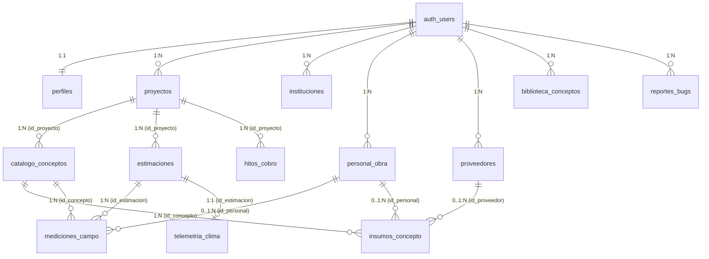

# ESTIMAPP v2.0 - MODELO DE DATOS Y DICCIONARIO RELACIONAL OFICIAL

> **LECTURA OBLIGATORIA PARA AGENTES DE SOFTWARE:**  
> Este documento contiene la definición canónica del modelo de datos de Estimapp v2.0 implementado en **PostgreSQL sobre Supabase Cloud**. Todo agente o desarrollador que formule consultas SQL, inserciones o mutaciones debe respetar estrictamente los nombres de columnas, tipos de datos, restricciones y políticas RLS aquí declarados.

---

## 1. Diagrama Entidad-Relación (ERD)



---

## 2. Diccionario de Tablas Relacionales (Esquema `public`)

### 2.1 `perfiles`
Extensión de los datos de identidad y despacho de los usuarios registrados en `auth.users`.
- **Row Level Security (RLS)**: Activado. Usuarios solo leen y actualizan su propio perfil (`auth.uid() = id`). Los administradores tienen visibilidad global para gestión de cuentas.

| Columna | Tipo de Dato | Nullable | Default | Restricción | Descripción |
| :--- | :--- | :---: | :---: | :---: | :--- |
| `id` | `UUID` | NO | — | PK / FK a `auth.users(id)` | Identificador único de usuario. |
| `nombre` | `TEXT` | NO | — | — | Nombre(s) del usuario. |
| `apellido_paterno` | `TEXT` | NO | — | — | Primer apellido. |
| `apellido_materno` | `TEXT` | SÍ | `NULL` | — | Segundo apellido (opcional). |
| `empresa_despacho` | `TEXT` | SÍ | `NULL` | — | Nombre comercial del despacho o constructora. |
| `rol` | `TEXT` | SÍ | `'residente'` | — | Rol en la plataforma (`'residente'`, `'superadmin'`). |
| `es_admin` | `BOOLEAN` | NO | `false` | — | Bandera de acceso a la Consola de Administración. |
| `created_at` | `TIMESTAMPTZ` | SÍ | `now()` | — | Fecha y hora de creación de la cuenta. |

---

### 2.2 `instituciones`
Catálogo maestro de dependencias, dependencias públicas o clientes institucionales del usuario.
- **RLS**: Activado (`auth.uid() = user_id`).

| Columna | Tipo de Dato | Nullable | Default | Restricción | Descripción |
| :--- | :--- | :---: | :---: | :---: | :--- |
| `id` | `BIGINT` | NO | `nextval(...)` | PK | Identificador numérico secuencial. |
| `user_id` | `UUID` | SÍ | — | FK a `auth.users(id)` | Propietario de la institución. |
| `nombre` | `TEXT` | NO | — | — | Nombre oficial (ej. IMSS, PJF, SEDENA, CFE, Privado). |
| `created_at` | `TIMESTAMPTZ` | SÍ | `now()` | — | Fecha de registro. |

---

### 2.3 `proyectos`
Contratos de obra pública o privada gestionados por el usuario.
- **RLS**: Activado (`auth.uid() = user_id`).

| Columna | Tipo de Dato | Nullable | Default | Restricción | Descripción |
| :--- | :--- | :---: | :---: | :---: | :--- |
| `id` | `BIGINT` | NO | `nextval(...)` | PK | Identificador único del proyecto. |
| `user_id` | `UUID` | SÍ | — | FK a `auth.users(id)` | Usuario propietario del contrato. |
| `nombre_obra` | `TEXT` | NO | — | — | Nombre descriptivo del contrato o proyecto. |
| `descripcion_sintetica`| `TEXT` | SÍ | `NULL` | — | Resumen de los alcances de la obra. |
| `ubicacion` | `TEXT` | SÍ | `NULL` | — | Ubicación textual libre o municipio/estado. |
| `unidad` | `TEXT` | SÍ | `NULL` | — | Unidad o dependencia ejecutora interna. |
| `contrato_no` | `TEXT` | SÍ | `NULL` | — | Número oficial de contrato o licitación. |
| `concurso_no` | `TEXT` | SÍ | `NULL` | — | Número de concurso / procedimiento. |
| `contratista` | `TEXT` | SÍ | `NULL` | — | Razón social de la empresa constructora. |
| `residente_obra` | `TEXT` | SÍ | `NULL` | — | Nombre del ingeniero residente a cargo. |
| `modalidad` | `TEXT` | SÍ | `'publica'` | CHECK (`'publica'`, `'privada'`, `'mixta'`) | Modalidad operativa del proyecto. |
| `tipo_obra` | `TEXT` | SÍ | `'obra_nueva'` | — | Tipología (`obra_nueva`, `remodelacion`, etc.). |
| `porcentaje_indirectos`| `NUMERIC` | SÍ | `15.0` | — | % de sobrecosto por gastos indirectos. |
| `porcentaje_utilidad` | `NUMERIC` | SÍ | `15.0` | — | % de margen de utilidad pactado. |
| `porcentaje_herramienta`| `NUMERIC` | SÍ | `5.0` | — | % de costo de herramienta menor y equipo. |
| `porcentaje_iva` | `NUMERIC` | SÍ | `16.0` | — | % de Impuesto al Valor Agregado. |
| `formatted_address` | `TEXT` | SÍ | `NULL` | — | Dirección estandarizada geocodificada. |
| `pais` | `VARCHAR(50)` | SÍ | `'México'` | — | País de ejecución. |
| `estado` | `VARCHAR(100)`| SÍ | `NULL` | — | Estado / Entidad Federativa. |
| `municipio` | `VARCHAR(100)`| SÍ | `NULL` | — | Municipio o alcaldía. |
| `codigo_postal` | `VARCHAR(10)` | SÍ | `NULL` | — | Código postal oficial. |
| `direccion_calle` | `TEXT` | SÍ | `NULL` | — | Calle, número y colonia de la obra. |
| `latitud` | `NUMERIC(9,6)` | SÍ | `NULL` | — | Coordenada de latitud WGS84. |
| `longitud` | `NUMERIC(9,6)` | SÍ | `NULL` | — | Coordenada de longitud WGS84. |
| `created_at` | `TIMESTAMPTZ` | SÍ | `now()` | — | Fecha de registro. |

---

### 2.4 `catalogo_conceptos`
Presupuesto contractual oficial de la obra. Soporta arquitectura **Dual Path** (APU desglosado o P.U. directo).
- **RLS**: Activado (`EXISTS (SELECT 1 FROM proyectos p WHERE p.id = catalogo_conceptos.id_proyecto AND p.user_id = auth.uid())`).

| Columna | Tipo de Dato | Nullable | Default | Restricción | Descripción |
| :--- | :--- | :---: | :---: | :---: | :--- |
| `id` | `BIGINT` | NO | `nextval(...)` | PK | Identificador del concepto. |
| `id_proyecto` | `BIGINT` | NO | — | FK a `proyectos(id)` ON DELETE CASCADE | Proyecto al que pertenece el catálogo. |
| `clave` | `TEXT` | NO | — | — | Código o clave del concepto (ej. PRE-01). |
| `descripcion` | `TEXT` | NO | — | — | Descripción detallada de los trabajos. |
| `unidad` | `VARCHAR` | NO | — | — | Unidad de medida normalizada (`m²`, `m³`, `kg`, etc.). |
| `cantidad_contratada`| `NUMERIC` | NO | — | — | Volumen volumétrico total pactado. |
| `precio_unitario` | `NUMERIC` | NO | — | — | Precio Unitario contractual en MXN. |
| `costo_material` | `NUMERIC` | SÍ | `0` | Dual Path | Costo directo analítico de materiales. |
| `costo_mano_obra` | `NUMERIC` | SÍ | `0` | Dual Path | Costo directo analítico de mano de obra. |
| `costo_herramienta` | `NUMERIC` | SÍ | `0` | Dual Path | Costo analítico de herramienta y equipo. |
| `costo_indirecto` | `NUMERIC` | SÍ | `0` | Dual Path | Costo analítico de indirectos por concepto. |
| `porcentaje_utilidad`| `NUMERIC` | SÍ | `15.0` | Dual Path | % de utilidad específico de la partida. |
| `especialidad` | `TEXT` | SÍ | `NULL` | — | Especialidad (ej. Cimentación, Albañilería). |
| `categoria` | `TEXT` | SÍ | `NULL` | — | Subpartida o categoría de agrupación. |
| `created_at` | `TIMESTAMPTZ` | SÍ | `now()` | — | Fecha de alta del concepto. |

---

### 2.5 `biblioteca_conceptos`
Tabulador maestro centralizado de insumos y conceptos de referencia por institución.
- **RLS**: Activado (`auth.uid() = user_id`).

| Columna | Tipo de Dato | Nullable | Default | Restricción | Descripción |
| :--- | :--- | :---: | :---: | :---: | :--- |
| `id` | `BIGINT` | NO | `nextval(...)` | PK | Identificador del concepto maestro. |
| `user_id` | `UUID` | SÍ | — | FK a `auth.users(id)` | Usuario propietario. |
| `institucion` | `TEXT` | SÍ | `NULL` | — | Institución / Tabulador de origen. |
| `clave` | `TEXT` | NO | — | — | Clave de catálogo. |
| `descripcion` | `TEXT` | NO | — | — | Descripción técnica. |
| `unidad` | `VARCHAR` | NO | — | — | Unidad de medida normalizada. |
| `precio_referencial` | `NUMERIC` | SÍ | `0.00` | — | Precio unitario base referencial. |
| `costo_material` | `NUMERIC` | SÍ | `0` | Dual Path | Costo directo estimado de materiales. |
| `costo_mano_obra` | `NUMERIC` | SÍ | `0` | Dual Path | Costo directo estimado de mano de obra. |
| `costo_herramienta` | `NUMERIC` | SÍ | `0` | Dual Path | Costo directo de herramienta. |
| `costo_indirecto` | `NUMERIC` | SÍ | `0` | Dual Path | Costo indirecto base. |
| `especialidad` | `TEXT` | SÍ | `NULL` | — | Especialidad de obra. |
| `categoria` | `TEXT` | SÍ | `NULL` | — | Subpartida clasificatoria. |
| `created_at` | `TIMESTAMPTZ` | SÍ | `now()` | — | Fecha de registro. |

---

### 2.6 `personal_obra`
Directorio de mano de obra, destajistas y cuadrillas del despacho.
- **RLS**: Activado (`auth.uid() = user_id`).

| Columna | Tipo de Dato | Nullable | Default | Restricción | Descripción |
| :--- | :--- | :---: | :---: | :---: | :--- |
| `id` | `BIGINT` | NO | `IDENTITY` | PK | Identificador único del operario. |
| `user_id` | `UUID` | SÍ | — | FK a `auth.users(id)` ON DELETE CASCADE | Usuario o despacho empleador. |
| `nombre` | `TEXT` | NO | — | — | Nombre completo del trabajador o maestro. |
| `especialidad` | `TEXT` | SÍ | `'Albañilería'` | — | Oficio (`Albañilería`, `Pintura`, `Plomería`, etc.). |
| `costo_jornal_base` | `NUMERIC` | SÍ | `0` | — | Tarifa pactada por día / jornada en MXN. |
| `telefono` | `TEXT` | SÍ | `NULL` | — | Teléfono de contacto. |
| `created_at` | `TIMESTAMPTZ` | SÍ | `now()` | — | Fecha de registro. |

---

### 2.7 `proveedores`
Directorio comercial de casas de materiales, fletes y subcontratistas.
- **RLS**: Activado (`auth.uid() = user_id`).

| Columna | Tipo de Dato | Nullable | Default | Restricción | Descripción |
| :--- | :--- | :---: | :---: | :---: | :--- |
| `id` | `BIGINT` | NO | `IDENTITY` | PK | Identificador del proveedor. |
| `user_id` | `UUID` | SÍ | — | FK a `auth.users(id)` ON DELETE CASCADE | Usuario o despacho. |
| `nombre_comercial` | `TEXT` | NO | — | — | Nombre comercial o razón social. |
| `contacto` | `TEXT` | SÍ | `NULL` | — | Nombre del ejecutivo o encargado. |
| `telefono` | `TEXT` | SÍ | `NULL` | — | Teléfono de contacto. |
| `giro` | `TEXT` | SÍ | `'Materiales'` | — | Giro (`Materiales`, `Fletes / Retiro`, `Acabados`). |
| `created_at` | `TIMESTAMPTZ` | SÍ | `now()` | — | Fecha de registro. |

---

### 2.8 `insumos_concepto`
Descomposición fina de insumos elementales que conforman el APU de un concepto del catálogo.
- **RLS**: Activado vía relación con `catalogo_conceptos` y `proyectos`.

| Columna | Tipo de Dato | Nullable | Default | Restricción | Descripción |
| :--- | :--- | :---: | :---: | :---: | :--- |
| `id` | `BIGINT` | NO | `IDENTITY` | PK | Identificador del insumo. |
| `id_concepto` | `BIGINT` | SÍ | — | FK a `catalogo_conceptos(id)` ON DELETE CASCADE | Concepto que lo contiene. |
| `tipo_insumo` | `TEXT` | NO | — | CHECK (`material`, `mdeo`, `herramienta`, `subcontrato`, `indirecto`) | Categoría del insumo. |
| `descripcion_insumo`| `TEXT` | NO | — | — | Nombre del insumo (ej. Cemento Gris Tolteca). |
| `unidad` | `VARCHAR` | NO | — | — | Unidad de compra (ej. bulto, m³, jor). |
| `cantidad_unitaria`| `NUMERIC` | NO | `1.0` | — | Rendimiento o consumo por unidad de concepto. |
| `costo_unitario` | `NUMERIC` | NO | — | — | Costo de adquisición unitario. |
| `importe` | `NUMERIC` | SÍ | `STORED` | GENERATED (`cantidad_unitaria * costo_unitario`) | Importe derivado del insumo. |
| `id_proveedor` | `BIGINT` | SÍ | `NULL` | FK a `proveedores(id)` ON DELETE SET NULL | Proveedor sugerido. |
| `id_personal` | `BIGINT` | SÍ | `NULL` | FK a `personal_obra(id)` ON DELETE SET NULL | Mano de obra asignada. |
| `created_at` | `TIMESTAMPTZ` | SÍ | `now()` | — | Fecha de registro. |

---

### 2.9 `hitos_cobro`
Plan comercial de cobros y facturación de proyectos privados o mixtos.
- **RLS**: Activado vía relación con `proyectos`.

| Columna | Tipo de Dato | Nullable | Default | Restricción | Descripción |
| :--- | :--- | :---: | :---: | :---: | :--- |
| `id` | `BIGINT` | NO | `IDENTITY` | PK | Identificador del hito. |
| `id_proyecto` | `BIGINT` | SÍ | — | FK a `proyectos(id)` ON DELETE CASCADE | Proyecto asociado. |
| `concepto_hito` | `TEXT` | NO | — | — | Concepto (ej. Firma, Colado de Losa, Finiquito). |
| `porcentaje` | `NUMERIC` | NO | — | — | Porcentaje del contrato amparado (%). |
| `monto_pactado` | `NUMERIC` | NO | — | — | Importe monetario a facturar. |
| `estado` | `TEXT` | SÍ | `'Pendiente'` | CHECK (`'Pendiente'`, `'Cobrado'`) | Estatus comercial del hito. |
| `fecha_cobro` | `DATE` | SÍ | `NULL` | — | Fecha real o estimada de liquidación. |
| `created_at` | `TIMESTAMPTZ` | SÍ | `now()` | — | Fecha de registro. |

---

### 2.10 `estimaciones`
Periodos oficiales de corte temporal para pago y auditoría de avance de obra.
- **RLS**: Activado vía relación con `proyectos`.

| Columna | Tipo de Dato | Nullable | Default | Restricción | Descripción |
| :--- | :--- | :---: | :---: | :---: | :--- |
| `id` | `BIGINT` | NO | `nextval(...)` | PK | Identificador del corte de estimación. |
| `id_proyecto` | `BIGINT` | NO | — | FK a `proyectos(id)` ON DELETE CASCADE | Contrato de obra asociado. |
| `num_periodo` | `INTEGER` | NO | — | — | Número correlativo (1, 2, 3, etc.). |
| `periodo_inicio` | `DATE` | NO | — | — | Fecha de inicio del corte. |
| `periodo_fin` | `DATE` | NO | — | — | Fecha de terminación del corte. |
| `fecha_elaboracion`| `DATE` | SÍ | `CURRENT_DATE` | — | Fecha de emisión del expediente. |
| `estado` | `VARCHAR` | SÍ | `'borrador'` | — | Estado (`borrador`, `en_revision`, `aprobada`). |
| `created_at` | `TIMESTAMPTZ` | SÍ | `now()` | — | Fecha de creación del registro. |

---

### 2.11 `mediciones_campo`
Números generadores de obra cuantificados en campo.
- **RLS**: Activado vía relación con `estimaciones` y `proyectos`.

| Columna | Tipo de Dato | Nullable | Default | Restricción | Descripción |
| :--- | :--- | :---: | :---: | :---: | :--- |
| `id` | `BIGINT` | NO | `nextval(...)` | PK | Identificador del generador. |
| `id_estimacion` | `BIGINT` | NO | — | FK a `estimaciones(id)` ON DELETE CASCADE | Estimación en la que se cobra. |
| `id_concepto` | `BIGINT` | NO | — | FK a `catalogo_conceptos(id)` ON DELETE CASCADE | Concepto cuantificado. |
| `id_personal` | `BIGINT` | SÍ | `NULL` | FK a `personal_obra(id)` ON DELETE SET NULL | Destajista responsable (Raya semanal). |
| `horas_o_jornales`| `NUMERIC` | SÍ | `1.0` | — | Jornales o esfuerzo invertido en la tarea. |
| `localizacion` | `TEXT` | SÍ | `NULL` | — | Elemento o área física (ej. Muro Norte PB). |
| `eje` | `TEXT` | SÍ | `NULL` | — | Ejes arquitectónicos (ej. A-C). |
| `tramo` | `TEXT` | SÍ | `NULL` | — | Tramos estructurales (ej. 1-4). |
| `largo` | `NUMERIC` | SÍ | `0` | — | Dimensión longitudinal (m). |
| `ancho` | `NUMERIC` | SÍ | `0` | — | Dimensión transversal (m). |
| `alto` | `NUMERIC` | SÍ | `0` | — | Dimensión vertical o peralte (m). |
| `piezas` | `NUMERIC` | SÍ | `1` | — | Número de repeticiones del elemento. |
| `cantidad_total` | `NUMERIC` | NO | — | — | Cantidad neta resultante en la unidad base. |
| `url_foto` | `TEXT` | SÍ | `NULL` | Multi-URL | URLs públicas separadas por comas en `evidencias`. |
| `url_croquis` | `TEXT` | SÍ | `NULL` | Multi-URL | URLs de croquis técnicos separadas por comas. |
| `created_at` | `TIMESTAMPTZ` | SÍ | `now()` | — | Fecha y hora de captura. |

---

### 2.12 `telemetria_clima`
Historial de condiciones meteorológicas registradas en sitio durante cada periodo de estimación.
- **RLS**: Activado vía relación con `estimaciones` y `proyectos`.

| Columna | Tipo de Dato | Nullable | Default | Restricción | Descripción |
| :--- | :--- | :---: | :---: | :---: | :--- |
| `id` | `BIGINT` | NO | `IDENTITY` | PK | Identificador del registro. |
| `id_estimacion` | `BIGINT` | SÍ | — | FK a `estimaciones(id)` ON DELETE CASCADE | Periodo de estimación vinculado. |
| `temp_media_c` | `NUMERIC` | SÍ | `NULL` | — | Temperatura promedio en °C. |
| `temp_max_c` | `NUMERIC` | SÍ | `NULL` | — | Temperatura máxima registrada en °C. |
| `precipitacion_mm` | `NUMERIC` | SÍ | `NULL` | — | Precipitación pluvial acumulada en mm. |
| `dias_lluvia` | `SMALLINT` | SÍ | `0` | — | Cantidad de días lluviosos en el periodo. |
| `humedad_relativa_pct`| `NUMERIC`| SÍ | `NULL` | — | Humedad relativa promedio en %. |
| `fetched_at` | `TIMESTAMPTZ` | SÍ | `now()` | — | Momento de la consulta a la API. |

---

### 2.13 `reportes_bugs`
Sistema integrado de gestión de incidencias, tickets de soporte y bugs del sistema.
- **RLS**: Activado (`auth.uid() = user_id` para usuarios regulares; administradores tienen acceso global).

| Columna | Tipo de Dato | Nullable | Default | Restricción | Descripción |
| :--- | :--- | :---: | :---: | :---: | :--- |
| `id` | `UUID` | NO | `gen_random_uuid()` | PK | Identificador único del reporte. |
| `folio` | `TEXT` | NO | `'BUG-' || ...` | UNIQUE | Folio correlativo formateado (ej. BUG-001). |
| `user_id` | `UUID` | SÍ | — | FK a `auth.users(id)` | Usuario que reportó la falla. |
| `tabs_afectadas` | `TEXT[]` | SÍ | `'{}'` | — | Lista de módulos con anomalías. |
| `categoria` | `TEXT` | NO | — | — | Clasificación (UI, Cálculos, Storage, etc.). |
| `descripcion` | `TEXT` | NO | — | — | Narrativa del problema y pasos de reproducción. |
| `archivos_adjuntos`| `TEXT[]` | SÍ | `'{}'` | — | Rutas relativas de archivos en bucket `bugs`. |
| `estado` | `TEXT` | NO | `'Abierto'` | — | Estado (`Abierto`, `En Revisión`, `Corregido`, `Validado`). |
| `notas_resolucion` | `TEXT` | SÍ | `NULL` | — | Explicación técnica de la solución implementada. |
| `comentarios_revision` | `TEXT` | SÍ | `NULL` | — | Observaciones y feedback del usuario durante iteraciones. |
| `created_at` | `TIMESTAMPTZ` | NO | `now()` | — | Fecha y hora de creación. |
| `updated_at` | `TIMESTAMPTZ` | NO | `now()` | — | Fecha y hora de última modificación. |

---

## 3. Vistas Analíticas (Feature Store de Machine Learning)

### `v_telemetria_rendimientos_ml`
Vista SQL materializable diseñada para entrenar modelos predictivos de rendimientos y costos unitarios viables:

```sql
SELECT 
    m.id AS medicion_id,
    p.id AS proyecto_id,
    p.modalidad,
    p.tipo_obra,
    p.estado AS estado_republica,
    p.municipio,
    EXTRACT(MONTH FROM m.created_at) AS mes_ejecucion,
    c.especialidad,
    c.categoria,
    c.unidad,
    c.cantidad_contratada AS volumen_total_contratado,
    c.precio_unitario AS precio_unitario_teorico,
    po.id AS trabajador_id,
    po.especialidad AS oficio_trabajador,
    po.costo_jornal_base,
    tc.temp_media_c,
    tc.temp_max_c,
    tc.precipitacion_mm,
    tc.dias_lluvia,
    m.cantidad_total AS avance_fisico_observado,
    COALESCE(m.horas_o_jornales, 1.0) AS esfuerzo_invertido,
    ROUND((m.cantidad_total / NULLIF(m.horas_o_jornales, 0))::NUMERIC, 4) AS target_rendimiento_mdeo
FROM public.mediciones_campo m
JOIN public.catalogo_conceptos c ON m.id_concepto = c.id
JOIN public.proyectos p ON c.id_proyecto = p.id
LEFT JOIN public.personal_obra po ON m.id_personal = po.id
LEFT JOIN public.telemetria_clima tc ON m.id_estimacion = tc.id_estimacion
WHERE m.cantidad_total > 0;
```

---

## 4. Almacenamiento en la Nube (Supabase Storage)

| Bucket | Nivel de Acceso | Tipos Admitidos | Propósito y Estructura |
| :--- | :--- | :--- | :--- |
| **`evidencias`** | Público (con RLS) | `.jpg`, `.jpeg`, `.png` | Fotos de avance y croquis de campo. Nombres UUID optimizados con Pillow (máx 1280px). |
| **`plantillas`** | Público (Lectura) | `.xlsx` | Plantillas maestras base oficiales para inyección binaria (IMSS, PJF). |
| **`bugs`** | Privado (RLS Admin/Owner) | `.jpg`, `.png`, `.pdf`, `.zip` | Adjuntos de reportes de bugs estructurados bajo la ruta `{folio}/{nombre_archivo}`. |
