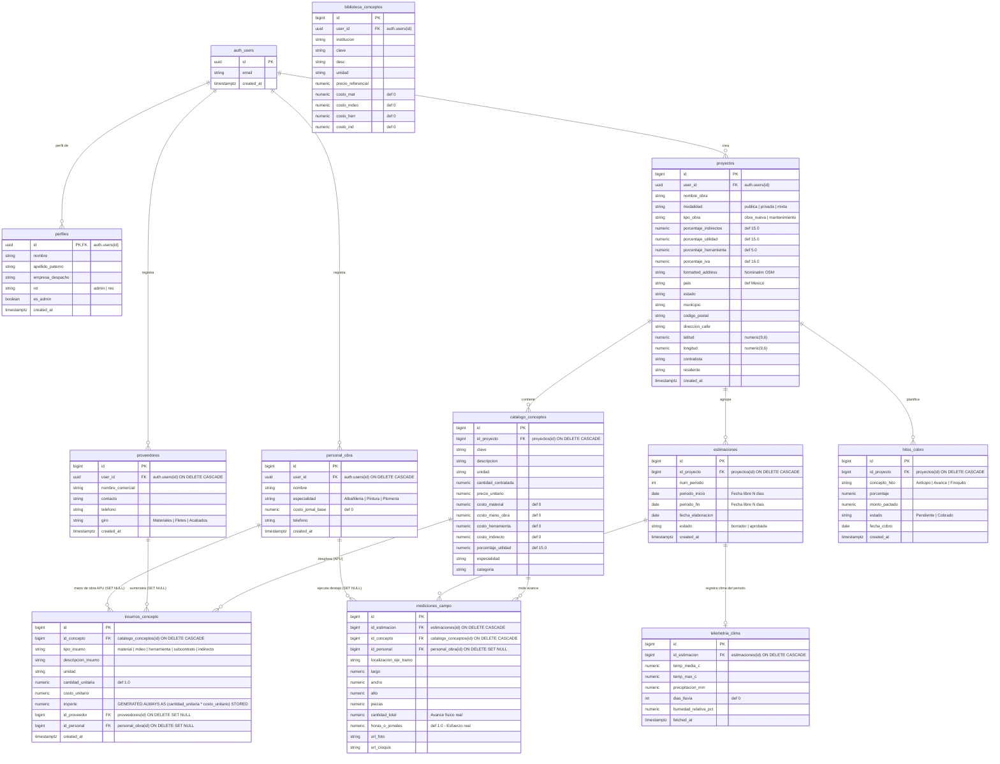

# ESTIMAPP v2.0 - Arquitectura de Base de Datos y Modelo Entidad-Relación

Este documento define la arquitectura integral de datos para la versión 2.0 de **Estimapp**, dando soporte nativo a **Obra Pública, Obra Privada y Mixta**, desglose analítico de costos (**Dual Path APU**), gestión de destajistas (**Personal de Obra**), directorio de **Proveedores**, geocodificación abierta (**OpenStreetMap / Nominatim**), telemetría climática (**Open-Meteo**) y **Feature Store** para Machine Learning.

---

## 1. Diagrama Entidad-Relación (Mermaid.js)



---

## 2. Diccionario de Datos y Reglas de Integridad

### 2.1 Tabla `public.proyectos` (Extensión v2.0)
Almacena los metadatos de obra, incorporando factores de costo universales y geodatos estructurados de libre acceso.

| Columna | Tipo | Nullable | Default | Descripción / Restricciones |
| :--- | :--- | :--- | :--- | :--- |
| `id` | `BIGINT` | NO | Generated Identity | Identificador único del proyecto. |
| `user_id` | `UUID` | NO | - | FK a `auth.users(id)`. Aislamiento RLS. |
| `nombre_obra` | `TEXT` | NO | - | Nombre descriptivo del contrato u obra. |
| `modalidad` | `TEXT` | NO | `'publica'` | `CHECK (modalidad IN ('publica', 'privada', 'mixta'))`. |
| `tipo_obra` | `TEXT` | NO | `'obra_nueva'` | Ej. `obra_nueva`, `mantenimiento`, `remodelacion`. |
| `porcentaje_indirectos` | `NUMERIC` | NO | `15.0` | Factor general de gastos indirectos de obra. |
| `porcentaje_utilidad` | `NUMERIC` | NO | `15.0` | Margen de utilidad comercial proyectado. |
| `porcentaje_herramienta` | `NUMERIC` | NO | `5.0` | Porcentaje de herramienta menor / equipo de seguridad. |
| `porcentaje_iva` | `NUMERIC` | NO | `16.0` | Impuesto al Valor Agregado aplicable. |
| `formatted_address` | `TEXT` | SÍ | `NULL` | Dirección normalizada devuelta por Nominatim (OSM). |
| `pais` | `VARCHAR(50)` | SÍ | `'México'` | País de ejecución. |
| `estado` | `VARCHAR(100)` | SÍ | `NULL` | Entidad federativa resuelta. |
| `municipio` | `VARCHAR(100)` | SÍ | `NULL` | Municipio o alcaldía resuelta. |
| `codigo_postal` | `VARCHAR(10)` | SÍ | `NULL` | Código postal. |
| `direccion_calle` | `TEXT` | SÍ | `NULL` | Calle, número y colonia de la obra. |
| `latitud` | `NUMERIC(9,6)` | SÍ | `NULL` | Coordenada geográfica WGS84 para Open-Meteo. |
| `longitud` | `NUMERIC(9,6)` | SÍ | `NULL` | Coordenada geográfica WGS84 para Open-Meteo. |

### 2.2 Tablas Satélite: `public.proveedores` y `public.personal_obra`
Entidades transversales pertenecientes al despacho (`user_id`). **No se borran si se elimina un proyecto.**

#### `public.proveedores`
| Columna | Tipo | Nullable | Default | Descripción |
| :--- | :--- | :--- | :--- | :--- |
| `id` | `BIGINT` | NO | Generated Identity | Identificador único del proveedor. |
| `user_id` | `UUID` | NO | - | FK a `auth.users(id)`. Propietario del registro. |
| `nombre_comercial`| `TEXT` | NO | - | Razón comercial (ej. "Concretos Tolteca", "Ferretera La Paz"). |
| `contacto` | `TEXT` | SÍ | `NULL` | Nombre del agente de ventas o encargado. |
| `telefono` | `TEXT` | SÍ | `NULL` | Teléfono de contacto / WhatsApp. |
| `giro` | `TEXT` | SÍ | `'Materiales'` | Categoría: `Materiales`, `Fletes / Retiro`, `Acabados`, `Maquinaria`. |

#### `public.personal_obra`
| Columna | Tipo | Nullable | Default | Descripción |
| :--- | :--- | :--- | :--- | :--- |
| `id` | `BIGINT` | NO | Generated Identity | Identificador único del trabajador. |
| `user_id` | `UUID` | NO | - | FK a `auth.users(id)`. Propietario del registro. |
| `nombre` | `TEXT` | NO | - | Nombre completo del destajista o maestro de obra. |
| `especialidad` | `TEXT` | SÍ | `'Albañilería'` | Especialidad/Oficio: `Albañilería`, `Fierrero`, `Pintura`, `Plomería`, etc. |
| `costo_jornal_base`| `NUMERIC` | NO | `0.0` | Tarifa base diaria de referencia para cálculo de raya. |
| `telefono` | `TEXT` | SÍ | `NULL` | Teléfono de contacto. |

### 2.3 Mecanismo Dual Path: `catalogo_conceptos`, `biblioteca_conceptos` e `insumos_concepto`

* **Camino 1 (Rápido / Cerrado):** Se captura `precio_unitario` directamente (desglose en 0).
* **Camino 2 (Analítico / APU):** Se capturan `costo_material`, `costo_mano_obra`, `costo_herramienta` y `costo_indirecto`.
  * En `catalogo_conceptos`: `precio_unitario = (costo_directo + costo_indirecto) * (1 + porcentaje_utilidad / 100)`.
  * En `biblioteca_conceptos`: Solo costo base directo (sin utilidad, pues la utilidad pertenece al proyecto).
* **Composición Fina (`public.insumos_concepto`):** Detalle por partida o insumo individual asociado a un concepto del catálogo.

> ⚠️ **ADVERTENCIA CRÍTICA PARA EL AGENTE:**
> En la tabla `public.insumos_concepto`, la columna `importe` está definida como `GENERATED ALWAYS AS (cantidad_unitaria * costo_unitario) STORED`.
> **NUNCA incluir `importe` en sentencias `INSERT` o `UPDATE` desde Supabase o Python.** Intentar insertarlo causará una excepción de PostgreSQL (`cannot insert into column "importe"`).

### 2.4 Control de Destajos: `public.mediciones_campo`
* Se agregan las columnas `id_personal` (`BIGINT REFERENCES public.personal_obra(id) ON DELETE SET NULL`) y `horas_o_jornales` (`NUMERIC DEFAULT 1.0`).
* Permite liquidar nómina/raya en la Tab 3 multiplicando el avance o tiempo real por las tarifas acordadas.

### 2.5 Hitos Financieros y Clima: `hitos_cobro` y `telemetria_clima`
* `public.hitos_cobro`: Seguimiento de cobro comercial para obra privada/mixta (Anticipo, Estimaciones intermedias, Finiquito).
* `public.telemetria_clima`: Registro meteorológico histórico del periodo de estimación, poblado silenciosamente desde la API de Open-Meteo.

---

## 3. Políticas de Integridad Referencial y Borrado

1. **Borrado de Proyecto (`public.proyectos`):**
   * `ON DELETE CASCADE` hacia `catalogo_conceptos`, `estimaciones`, `hitos_cobro` y sus descendientes directos (`mediciones_campo`, `insumos_concepto`, `telemetria_clima`).
2. **Borrado de Personal o Proveedores (`personal_obra`, `proveedores`):**
   * `ON DELETE SET NULL` en `mediciones_campo.id_personal`, `insumos_concepto.id_personal` e `insumos_concepto.id_proveedor`.
   * **Propósito:** Si un albañil o ferretería se elimina del directorio del despacho, los históricos de estimaciones pasadas no pierden sus mediciones ni sus importes.

---

## 4. Feature Store de Machine Learning (`v_telemetria_rendimientos_ml`)

Vista analítica para entrenar modelos predictivos de rendimientos y costos:

```sql
CREATE OR REPLACE VIEW public.v_telemetria_rendimientos_ml AS
SELECT 
    m.id AS medicion_id,
    p.id AS proyecto_id,
    p.modalidad,
    p.tipo_obra,
    p.estado AS estado_republica,
    p.municipio,
    EXTRACT(MONTH FROM m.created_at) AS mes_ejecucion,
    c.especialidad,
    c.categoria,
    c.unidad,
    c.cantidad_contratada AS volumen_total_contratado,
    c.precio_unitario AS precio_unitario_teorico,
    po.id AS trabajador_id,
    po.especialidad AS oficio_trabajador,
    po.costo_jornal_base,
    tc.temp_media_c,
    tc.temp_max_c,
    tc.precipitacion_mm,
    tc.dias_lluvia,
    m.cantidad_total AS avance_fisico_observado,
    COALESCE(m.horas_o_jornales, 1.0) AS esfuerzo_invertido,
    ROUND((m.cantidad_total / NULLIF(m.horas_o_jornales, 0))::NUMERIC, 4) AS target_rendimiento_mdeo
FROM public.mediciones_campo m
JOIN public.catalogo_conceptos c ON m.id_concepto = c.id
JOIN public.proyectos p ON c.id_proyecto = p.id
LEFT JOIN public.personal_obra po ON m.id_personal = po.id
LEFT JOIN public.telemetria_clima tc ON m.id_estimacion = tc.id_estimacion
WHERE m.cantidad_total > 0;
```
